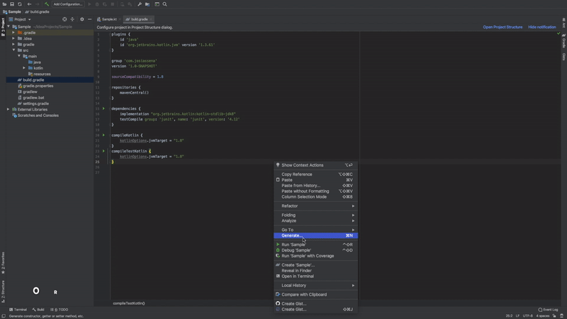
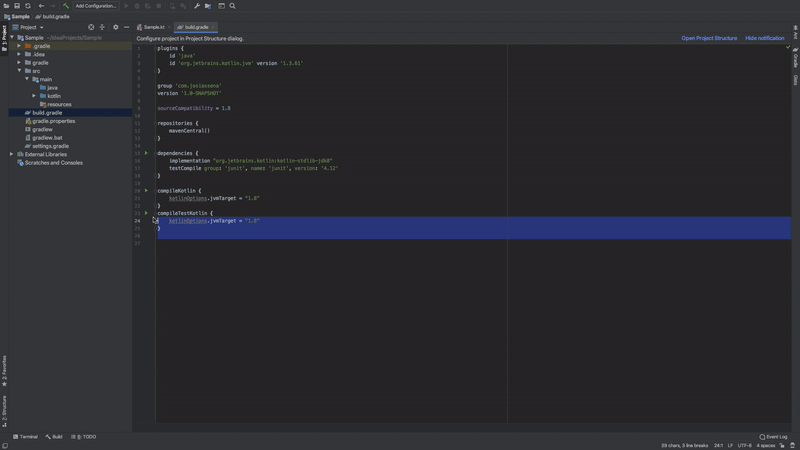

# Github Gists

A simple GitHub plugin that allows you to create gists, and also view your gists from within your IDE.

#### Features
 - Create Gist with keyboard shortcut (Command + Shift + J)
 - Edit Gist before uploading
 - Create Gist from current selection
 - All of your gists are displayed in a Gist pane right in the IDE

#### Limitations (For now)
 - Does not support creating Gists from entire directories
 - Does not support creating gist from multiple files

## License

[Apache 2](https://github.com/JosiasSena/GitHubGists/blob/master/LICENSE)